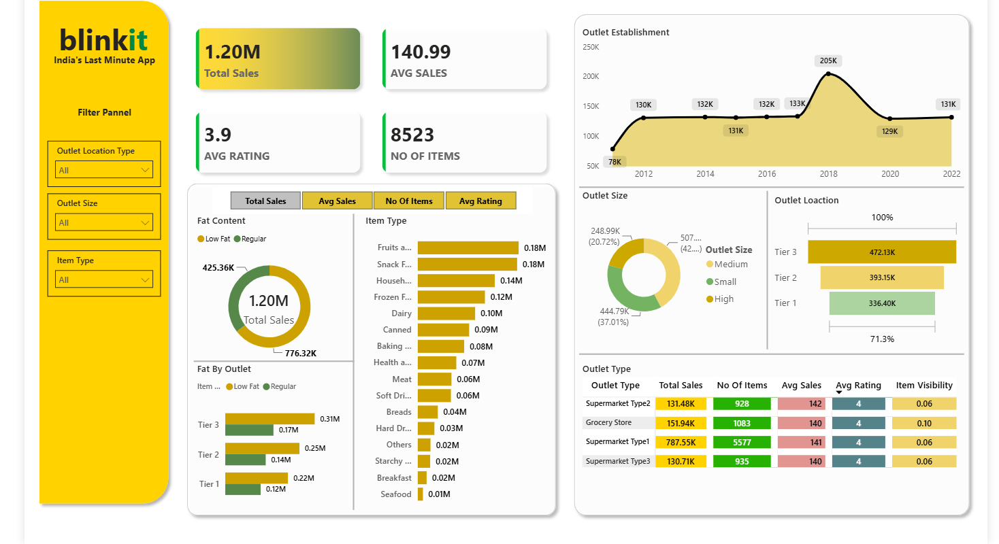

# Blinkit Sales Analysis Dashboard | Power BI

## 📊 Overview

This project is an interactive Power BI dashboard created to analyze Blinkit sales data.

The dashboard transforms raw sales data into meaningful business insights using data cleaning, transformation, DAX calculations, and visualization.

## 🎯 Objective

The objective of this project is to analyze sales performance, outlet trends, product categories, and customer ratings to understand business growth patterns.

## 🛠 Technologies Used

- Microsoft Power BI
- Power Query
- DAX
- Data Visualization
- Excel / CSV Dataset

## 📌 Dashboard Features

- Total Sales KPI
- Average Sales Analysis
- Average Rating Analysis
- Total Item Count
- Outlet Performance Analysis
- Item Type Analysis
- Fat Content Analysis
- Outlet Size Analysis
- Location-wise Sales Analysis

## 📈 Key Insights

- Total sales analyzed: 1.20M
- Average sales value: 140.99
- Average rating: 3.9
- Supermarket Type 1 generated the highest sales contribution
- Tier 3 outlets showed strong revenue performance
- Fruits and Snacks were among the top-selling categories

## 📸 Dashboard Preview

## 📂 Project Structure
